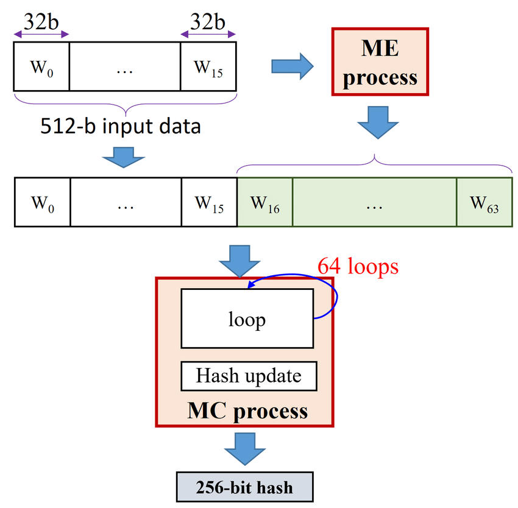

# Blockchain

Blockchain is decentralized constant registry supported by peer-to-peer
network which allows only additions to itself by approval of all peers.

Key points:

- network has no server, peers maintain registry and collectively approve transactions
- existing registry is constant and supports only appending new blocks
- each change to registry must be approved by validation mechanism (called consensys)

Three types of Blockchain are used:

- private: only trusted peers are added
- public: every peer is welcomed
- consorcium: some HR nodes in blockchain welcome you

## Hash SHA-256

Blockchain puts emphasis on validation of each block in chain, so
it requires all-rounded hashing algorithm that is fast enough and 
cryptographically secure.

Key points (features of secure hashing)

- hard to find collisions with hash given
- hard to find initial message by hash
- hard to find collisions on any hash possible

Blockchains are may use SHA-256. This algorithm supports
texts with length lower than 2^64 devisable by 512 (block size is 512 bits), if
not the remaining space is filled by following rule:

```
[text][any number of zeros][64-bit length of text] % 512 == 0
```

Algorithm parses each 512-bit block, generating message schedule from current block
and then modified pre-defined hash words, that are, in fact, resulting hash:



## Merkle tree

A common problem in Blockchain is to find hash from all
transactions upon adding a new one. For that binary tree with
group hashes called Merkle tree is used, upon adding a new node,
only one branch is re-evaluated:


## Consensys

To approve new transaction peers must first approve it.
To do this, algorithms like Proof-of-Work and Proof-of-Stake.
- PoW requires adding node to solve hard math problem of finding 
transaction's hash with specific ceiling. That involves intense calculations,
which are rewarded by crypto-currency.
- PoS is based on assumption that node that has certain investments
in Blockchain won't attack it. Some trusted nodes (validators) approve/disapprove
transactions, and get taxed or rewarded for validity of those.

PoW is better :)

## Attacks

- Sybil attack
- 51% attack

### Sybil attack

Sybil attack is based on incorrect Consensys algorithm.
If attacker is able to swarm P2P network with controlled validator nodes
and achieve approval by sheer number of approving nodes, it may lead
to incorrect block being added to registry. To combat that, PoW and PoS are used.

### 51% attack

51% attack is also based on incorrect Consensys algorithm.
If attacker has enough calculation potency, they might create parallel
chain that is at some point is becoming longer that the whole network can create
and then replace an existing one. Combat it the same way as Sybil attack.

